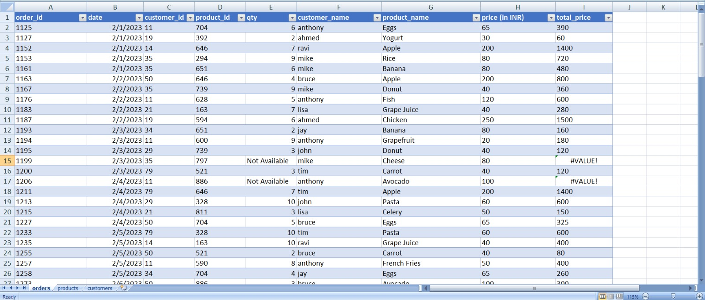
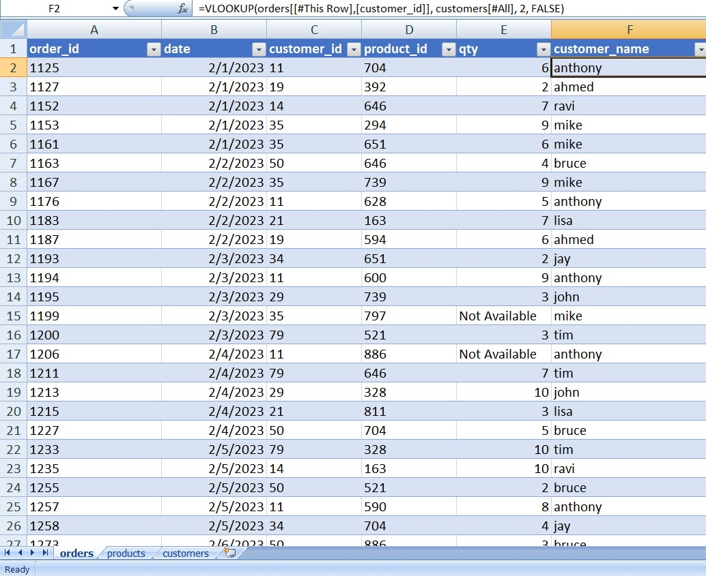

# excel-data-cleaning-project
Sales data cleaning and analysis using Excel (VLOOKUP, INDEX-MATCH, XLOOKUP)

# 📊 Excel Data Cleaning & Analysis Project

## 📌 Project Overview

This project focuses on cleaning and analyzing sales data using Microsoft Excel. The goal was to transform raw data into a structured and analysis-ready format.

---

## 🧹 Data Cleaning Steps

* Removed leading/trailing spaces
* Identified and removed duplicate values using conditional formatting
* Split merged columns (price & currency symbol)
* Converted text formats (uppercase to lowercase)
* Corrected data types

---

## 📊 Functions Used

* VLOOKUP
* INDEX + MATCH
* XLOOKUP
* IF formulas

---

## 📈 Key Learnings

* Data preprocessing techniques
* Handling missing and inconsistent data
* Using lookup functions efficiently
* Improving data accuracy for analysis

---

## 📂 Files Included

* Raw dataset
* Cleaned dataset
* Screenshots of work

---

## 🚀 Tools Used

* Microsoft Excel

---

## 📬 Connect with Me

LinkedIn: (https://www.linkedin.com/in/anuj-kumar-singh-9932b7198/)

## ⚠️ Note
This project uses simulated data for learning purposes.

